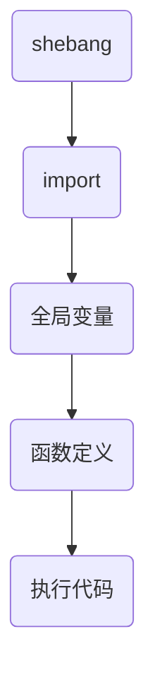

## python笔记

### 函数的基本使用

1.PyCharm的调试工具

> F8 Step Over

> F7 Step Into 

2.函数说明的规范格式

```python
def main():
    """hello"""
```

> 在调用函数的位置用Ctrl+Q查看

3.return 后续的代码不会被执行

4.点击函数名，选择Insert，可以为参数添加标准的注释

### 模块的基本使用

1.在模块中定义的**全局变量**、**函数**都是模块能够提供给外界直接使用的工具

2.在导入模块时或者直接运行python脚本时自动执行所有代码。如果你不需要它在导入时执行，可以将它放在

```python
if __name__ == '__main__':
```

3.import会将模块文件编译成pyc文件，pyc文件是由python解释器将模块的源码转换为字节码

> C是complied**编译**过的意思

> python这样保存**字节码**是作为一种启动速度的优化


### 高级变量类型

1.在python中，所有**非数字型变量**都支持以下特点：**序列**、**取值**`[]`、**遍历**`for in`、**链接**`+`、**重复**、**切片**

2.列表 用`[ ]`定义，数据之间用`,`分隔

> 列表的**索引**从0开始

3.在ipython中新建一个列表，例如`name_list  =  [ ]`,输入`name_list.`按下`TAB`键，ipython会提示列表能够使用的**方法**

4.**del**关键字本质上是用来将一个变量从内存中删除，要从列表中删除数据，优先采用列表提供的方法

5.如果传递的参数后有等号，那么调用这个函数的时候可以不传递参数

<p align="left">6.</p>
- **关键字**是python内置的标识符

> 关键字后面不需要小括号

- **函数**封装了独立功能，可以直接调用
- **方法**需要通过对象来调用，表示针对这个**对象**的操作

7.**列表**的**应用场景**

- 尽管python的**列表**中可以**存储不同类型的数据**
- 但是**列表**通常存储相同类型的数据，通过**迭代遍历**对**列表元素**进行相同操作

8.`Tuple`与列表类似，不同之处在于元组的**元素不能修改**，**元组**用`()`定义，**索引**操作依然用`[]`

9.定义只包含一个元素的元组，需要在**元素后添加括号**，否则python的解释器只关心小括号中的内容

10.元组通常保存**数据类型不同的元素**，针对元组的循环遍历需求并不是很多

11.元组的应用场景

- **函数的参数和返回值**，一个函数可以接收**任意多个函数**，或者**一次返回多个数据**

- **格式字符串**，格式化字符串后面的`()`本质上就是一个元组

  ```python
  print("%s 年龄是 %d 身高是 %.2f " % ("小明", 18, 1.75))
  ```

- **让列表不可被修改**

12.字典和列表的区别

- **列表**是**有序**的**对象**集合
- **字典**是**无序**的对象集合

13.字典用`{}`定义

14.字典使用**键值对**存储数据，键值对之间使用`,`分隔

- **键**`key`是索引
- **值**`value`是数据
- **键**和**值**之间用`:`分隔
- **键**必须是唯一的
- **值**可以取任何数据类型，但**键**只能使用**字符串**、**数字**、**元组**

15.合并字典使用`update`方法，如果被合并的字典中包含已经存在的键值对，会覆盖原有键值对

16.字典的应用场景：

- 使用多个**键值对**，存储**描述一个物体的相关信息**
- 将**多个字典**放在**一个列表**中，再进行遍历，在循环体内部针对每一个字典进行**相同处理**

17.在Python中可以使用**一对双引号**或**一对单引号**定义字符串

> 大多数编程语言使用双引号定义字符串

- 如果字符串内部需要使用`""`，可以使用`''`定义字符串

18.字符串中查找和替换

- ​	

  - `index`如果指定的字符串不存在，会报错

  - `find`如果指定的字符串不存在，会返回-1

- `replace`方法执行完成后，会返回一个新的字符串

19.切片操作`字符串[开始索引：结束索引：步长]`

> 结束索引对应的字符取不到，指定的区间属于**左闭右开**型

> 到末尾结束，可以省略结束索引对应的数字

20.字符串的逆序`str[-1::-1]`

### 公共方法

1.del有两种方式：函数()，关键字

2.`max()`和`min()`只会对`key`排序，不会对`value`排序

3.**字典**是一个**无序**的集合，是使用**键值对**保存数据，**切片**使用**索引值**来限定范围，不能针对字典进行切片

4.`[].extend()`会修改调用的列表，列表为参数时会被打散，`+`会生成一个新的对象，`[].append()`会把列表参数当成整体插入

5.

- `in`和`not in`被称为**成员运算符**

- `in`在对**字典**操作时，判断的是**字典的键**

6.完整的for循环语法

```python
for 变量 in 集合:
	循环体代码
else:
	没有通过break退出循环，循环结束后，会执行对应语句
```

**应用场景**

- 在**迭代遍历**嵌套的数据类型时，例如**一个列表包含了多个字典**

- 需求：要判断某一个字典中是否存在指定的值
  - 如果**存在**，提示并退出循环
  - 如果**不存在**，在**循环整体结束**后，希望得到一个**统一的提示**

### 项目操作

1.如果在开发时不希望立刻编写分支内部的代码，可以使用`pass`关键字，表示一个占位符，能够保证程序执行

2.**TODO**注释用于标记未完成的工作

`#TODO (作者、邮件) 未完成的工作`

> TODO没有变色可能是因为文件没有在Project目录下

3.python是解释性语言，需要操作的变量应该**定义在程序的顶部**

4.如果`return`后面没有任何内容，会返回到调用函数的位置，且不返回任何结果，善用`return`可以处理`if`对应的特殊情况而不用添加`else`


### Shebang符号（#！）

> 指明**执行这个脚本文件**的解释程序

**使用Shebang的步骤**

- 查询python3解释器路径

  ```shell
  which python3
  ```

- 添加到主文件

  ```python 
  #！ /home/liwei/anaconda3/envs/test/bin/python3
  ```

- 增加权限

  ```shell
  chmod +x  main.py
  ```

- 脚本启动

  ```shel
  ./main.py
  ```

###  变量进阶

1.引用

- **变量**和**数据**都是分开存储的
- **数据**保存在内存中的一个位置
- **变量**中保存着数据在内存的地址
- **变量**中**记录数据的地址**就叫做**引用**

> 如果变量已经被定义，当给一个变量赋值的时候，本质上是**修改了数据的引用**

2.调用函数，本质上传递的是实参保存数据的引用，而不是实参保存的数据

3.函数的返回值也是数据的引用

> Python不允许程序员选择采用传值还是传引用。Python参数传递采用的肯定是“传对象引用”的方式。实际上，这种方式相当于传值和传引用的一种综合。如果函数收到的是一个可变对象（比如字典或者列表）的引用，就能修改对象的原始值——相当于通过“传引用”来传递对象。如果函数收到的是一个不可变对象（比如数字、字符或者元组）的引用，就不能直接修改原始对象——相当于通过“传值”来传递对象。

4.可变和不可变类型

- **不可变类型**，内存中的数据不允许被修改
  - 数字
  - 字符串
  - 元祖

- **可变类型**，内存中的数据可以被修改
  - 列表
  - 字典

5.**注意**

- **可变类型**的数据变化，是通过**方法**来实现的

- 如果给一个可变类型的变量，赋值了一个新的数据，**引用会修改**

6.**字典**的`key`**只能使用不可变类型的数据**

7.**哈希**

- `哈希`是一种算法，其作用是提取数据的**特征码**
  - **相同的内容**得到**相同的结果**
  - **不同的内容**得到**不同的结果**

- 在`Python`中，设置字典的`键值对`时，会首先对`key`进行`hash`已决定如何在内容中保存字典数据，以方便对字典的：**增、删、改、查**

8.**局部变量**和**全局变量**

- **局部变量的生命周期**
  - 函数执行时局部变量才会生成
  - 函数执行结束后，**函数内部的局部变量，会被系统回收**

- 不同的函数，可以定义相同名字的局部变量，彼此之间不会产生影响

> 其他语言大多**不推荐使用全局变量**，可变范围大，不好维护

- **函数不能直接修改全局变量的引用，但可以通过赋值语句修改全局变量的值**
  - 在`python`中，是不允许直接修改全局变量的值，如果使用赋值语句，会在函数内部定义一个局部变量
  - 如果需要在函数中修改全局变量的值，使用`global`关键字,再使用赋值语句时，就不会创建局部变量

- 全局变量需要定义在函数调用前才能正常访问，在开发时，应该把模块中的所有全局变量定义在所有函数的上方
- 代码结构



- 如果局部变量的名字和全局变量名字相同，pycharm会在局部变量下方显示灰色虚线

### 函数的高级话题

1.函数参数和返回值的作用

- 如果函数**内部处理的数据不确定**，就可以将外界的数据以参数传递到函数内部
- 如果希望一个函数**执行完成后，向外界汇报执行结果**，就可以增加函数返回值

2.返回值

- 如果函数返回的类型是元组，小括号可以省略
- 如果函数返回类型是元组，同时希望单独处理元祖中的元素，可以使用多个变量，一次接收函数的返回结果，变量的个数应该和元组中元素的个数保持一致

3.交换两个变量的值

- 法1

  ```python
  a = a + b
  b = a - b
  a = a - b
  ```

- 法2(python专有--省略小括号的元组)

 ```python
 a, b  = b,a
 ```

4.可变参数和不可变参数

- 在函数内部，针对参数使用赋值语句，会在**函数内部**修改**局部变量的引用，不会影响到外部变量的引用**，**不会修改到外部变量的引用**(与数据类型是否可变无关)
- 如果传递的参数是**可变类型**，使用**方法**会**影响到外部的数据**

5.在`python`中,**列表**的`+=`操作本质上是在执行变量的`extend`方法，**不会修改变量的引用**

> `+=`与 ```list = list + list```不用 

6.缺省参数

- 定义函数时，可以给**某个参数**指定一个**默认值**，具有默认值的参数叫做**缺省参数**
- 调用函数时，如果没有传入**缺省参数**的值，则在函数内部使用定义函数时的默认值
- **必须保证带有默认值的参数在参数列表末尾**
- 如果有多个**缺省参数**，需要指定参数名

